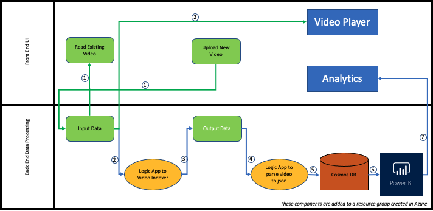
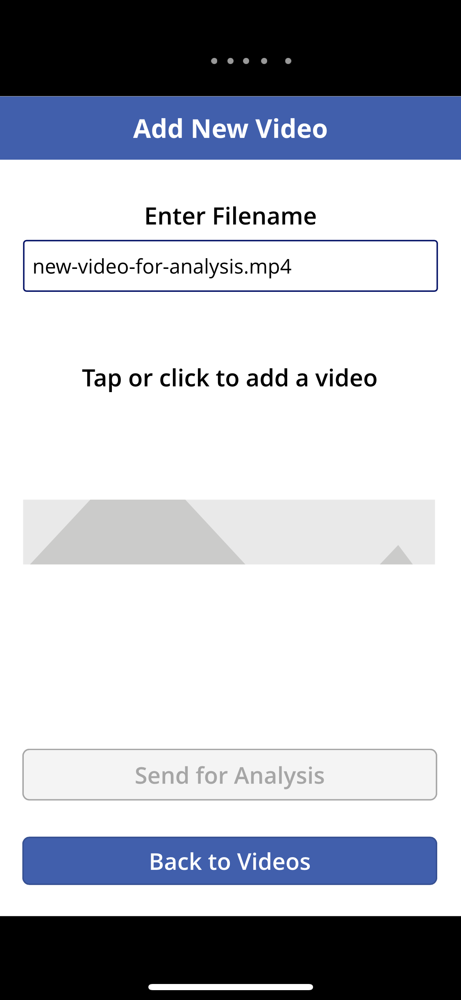
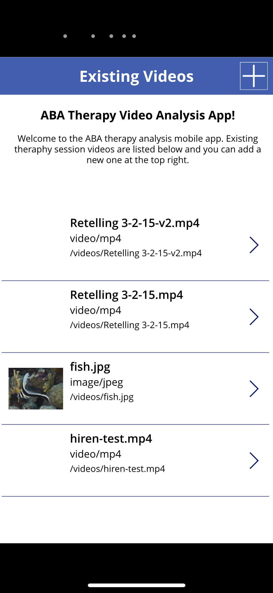
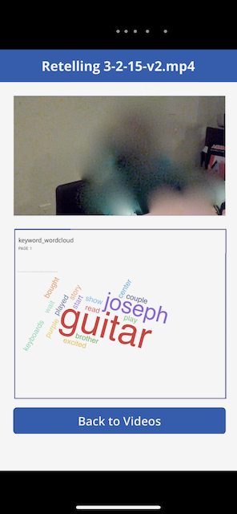
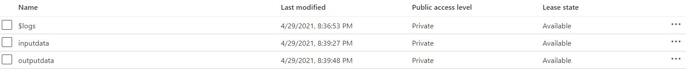
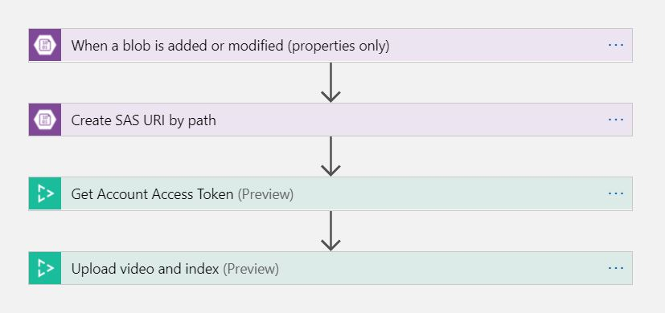
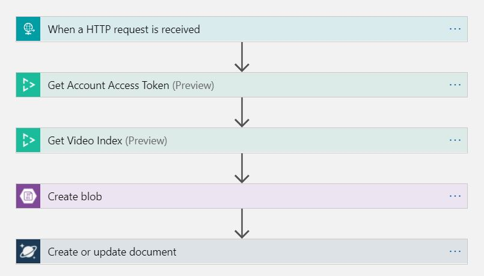

# ABA Therapy Cognitive App

This product has been built as a part of FSI Autism Hackathon 2021 using Microsoft Azure Services. 

## Product Description

ABA is an applied science devoted to developing procedures which will produce observable changes in behavior. Applied behaviour Analysis(ABA) Therapy is a type of therapy that can improve social,communication and learning skills. The purpose of this product is to get useful insights from video recorded therapy sessions. Parents or Therapists can use this app to Upload a therapy video and visualize the performance through the app. 

## Technical Description

### Architecture

#### Power App (Front End) 

This the UI where the user can upload recorded videos of therapy and can get the useful insights from the processed videos.

#### Containers

The uploaded video is going to stored in the input container of the Azure Cloud.

#### Logic App # 1 - Video Indexer
 
Once the new video is uploaded the video indexer gets triggered and video gets processsed. 

#### Logic App # 2

Gets triggered once the video is indexed and Uploads the JSON generated from indexer to output container.

[More Info](https://docs.microsoft.com/en-us/azure/media-services/video-indexer/logic-apps-connector-tutorial)

#### Cosmos DB

It is a storage solution for storing unstructured data like the output JSON.

#### Power BI

It is a Business Analytics Service used for getting useful insights from the processed data.

## Contribution

Any contributor is very welcome to contribute in this initiative.

## Refrences

## Future Scope
